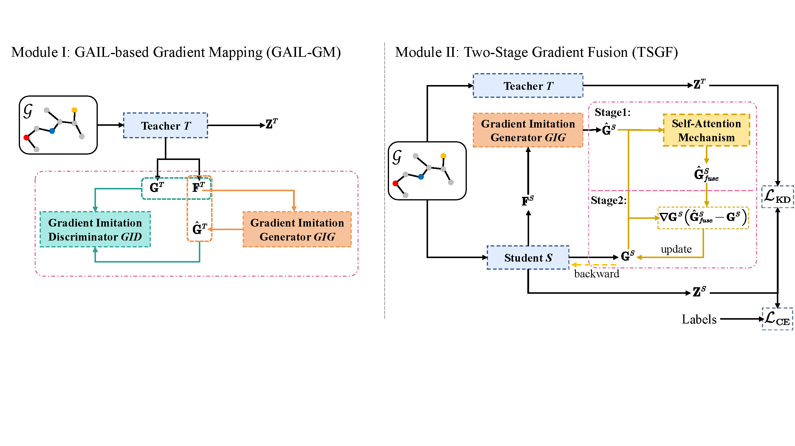

# Dynamic Gradient Knowledge Distillation Based on Imitation Learning

This repository provides an overview of the paper **"Dynamic Gradient Knowledge Distillation: An Inheritance and Extension Framework for Graph Neural Network Learning Process"**, authored by Kang Liu, Shunzhi Yang, Chang-Dong Wang, and Zhenhua Huang.

## Abstract
Graph Neural Networks (GNNs) have revolutionized the ability to interpret and analyze structured data. However, the increasing complexity of GNN architectures poses scalability and computational challenges. This paper introduces the **Dynamic Gradient Distillation (DGD)** framework to address these issues. DGD transfers knowledge from complex GNN teacher models to smaller, efficient student models using **Generative Adversarial Imitation Learning (GAIL)**.

### Key Features of DGD:
1. **GAIL-based Gradient Mapping (GAIL-GM)**:
   - Models temporal and spatial gradient changes of the teacher.
   - Provides dynamic and learnable strategies for the student.

2. **Two-Stage Gradient Fusion (TSGF)**:
   - Employs attention fusion to integrate gradients.
   - Uses weighted bias to enhance the student's optimization process.

### Main Contributions:
- Dynamic imitation of teacher gradients for enhanced student comprehension.
- Integration of attention mechanisms for efficient gradient fusion.
- Extensive experiments on seven public datasets showing state-of-the-art performance in node classification tasks.

## Results
The DGD framework was evaluated on **seven datasets** (e.g., Cora, Citeseer, Pubmed, and Arxiv) and demonstrated significant improvements over 17 baseline methods in **node classification tasks**. Both GNN-to-GNN (G2G) and GNN-to-MLP (G2M) architectures benefit from this approach, achieving higher accuracy and robustness.

## Framework Overview
  
*Illustration of the DGD framework with GAIL-GM and TSGF modules.*

### Components:
1. **GAIL-GM Module**:
   - Gradient Imitation Generator (GIG)
   - Gradient Imitation Discriminator (GID)

2. **TSGF Module**:
   - Self-attention-based gradient fusion.
   - Weighted bias gradient updates.

## Getting Started
### Prerequisites
- Python 3.8+
- [PyTorch](https://pytorch.org/)
- [DGL (Deep Graph Library)](https://www.dgl.ai/)
- Additional dependencies are listed in `requirements.txt`.

### Installation
Clone this repository and install the dependencies:
```bash
git clone https://github.com/KangL-G/Dynamic-Gradient-Distillation.git
cd dynamic-gradient-distillation


To run the framework, use the following command:
```bash
For teacher: python main.py --dataset cora --teacher_model gcn --student_model mlp --mode tea
For student: python main.py --dataset cora --teacher_model gcn --student_model mlp --mode stu

Acknowledgments
This paper was partially supported by the Natural Science Foundation of China (No. 62172166, 61772366, and 62276277) and the Guangdong Basic and Applied Basic Research Foundation (No. 2022A1515011380, 2022B1515120059).

License
You can replace placeholders such as repository URLs or image paths based on your specific needs. Let me know if you'd like assistance with anything else!
